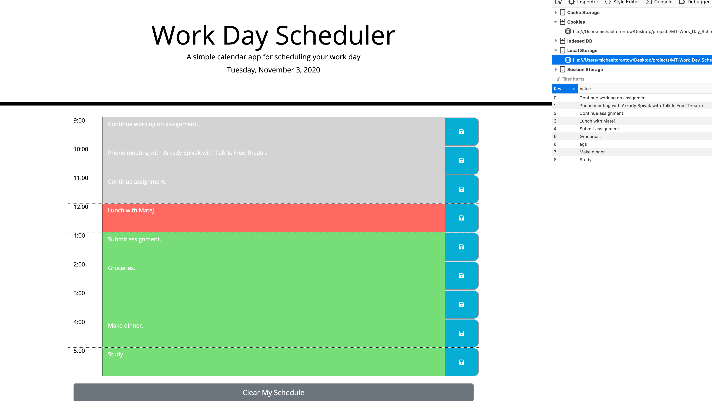

# Work Day Scheduler

![Final Product] "https://torontow.github.io/MT-Work_Day_Scheduler/"

## The Project

The client requested an application that will allow users to enter and save appointments, tasks, events, etcetera, for each hour of a traditional work day.

## The Process

The HTML and CSS files were provided. The HTML did not contain code that builds the scheduler grid. The CSS file left many clues, however, as to how one could use JavaScript to dynamically add the grid to the DOM. After analyzing the file, it was easy to pseudocode the JS and then construct the code. Later, it was just a matter of watching the scope of my variables to ensure proper functionality.

## Installation

Simply navigate to the site URL: "https://torontow.github.io/MT-Work_Day_Scheduler/"

## Usage

When the page loads, the user will see a form with whatever the current day's date is at the top, followed by a grid of spaces organized by hour which they can click and input whatever they wish. When they are happy with their entry, they click the blue save button on the right. Their input is saved in local storage, so if they close the tab and reopen the page, their entry will appear where they saved it.

BONUS: While the client didn't ask for it, I thought someone may find it useful to clear their schedule, should, say, something unexpected came up and they needed to completely shift gears that day. So, I added a "Clear My Schedule" button. 

## License

MIT License

## Credits

Manuel Cheng, Ed Apostol, and German Arcila for helping me through a challenge dealing with jQuery.
Bootstrap.com
jQuery.com
moment.js

